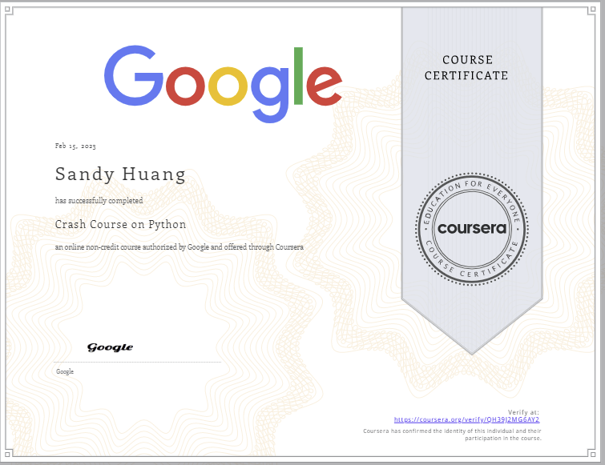

## [Crash Course on Python](https://www.coursera.org/learn/python-crash-course?specialization=google-it-automation)

This course is designed to teach you the foundations in order to write simple programs in Python using the most common structures. No previous exposure to programming is needed. By the end of this course, you'll understand the benefits of programming in IT roles; be able to write simple programs using Python; figure out how the building blocks of programming fit together; and combine all of this knowledge to solve a complex programming problem. 

We'll start off by diving into the basics of writing a computer program. Along the way, you’ll get hands-on experience with programming concepts through interactive exercises and real-world examples. You’ll quickly start to see how computers can perform a multitude of tasks — you just have to write code that tells them what to do.

### WHAT YOU WILL LEARN
* What Python is and why Python is relevant to automation
* How to write short Python scripts to perform automated actions
* How to use the basic Python structures: strings, lists, and dictionaries
* How to create your own Python objects

### SKILLS YOU WILL GAIN
* Basic Python Data Structures
* Fundamental Programming Concepts
* Basic Python Syntax
* Python Programming
* Object-Oriented Programming (OOP)

